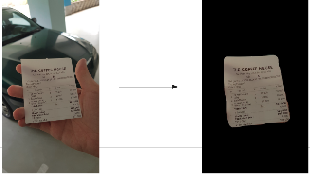
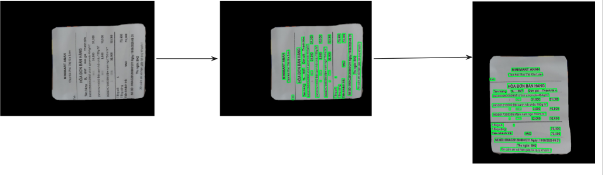
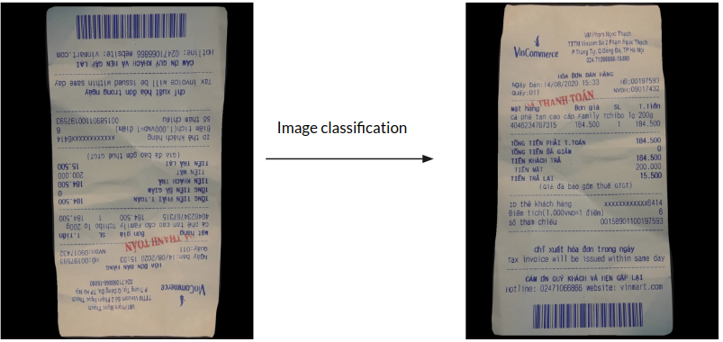
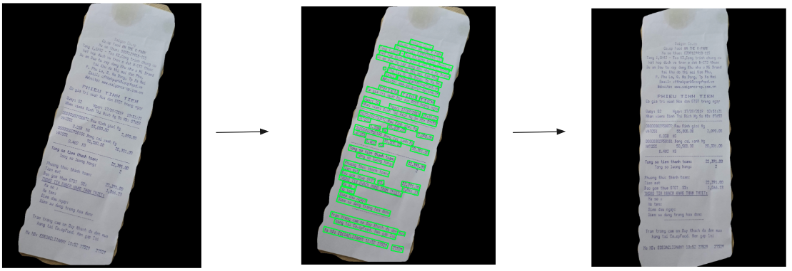
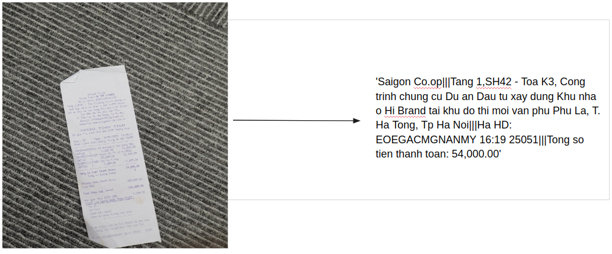

# MC-OCR
## Description
The Mobile capture receipts Optical Character Recognition (MC-OCR) challenge deliver two tasks: Receipt Image Quality Evaluation and OCR Recognition. In the first task,we  introduce a regression model to map various inputs such as the probability of the output OCR, cropped text  boxes, images to their label. In the second task, we propose a stacked multi-model as a solution to tackle this problem. The robust models are incorporated by image segmentation, image classification, text detection, text  recognition, and text classification. Follow this solution, we can get vital tackle  various noise receipt types such as horizontal, skew, and blur receipt.
## Dataset
Dataset have 3 parts include training data, public test data and privated test data.The training set have 1,155 training examples with the respective annotated information. The public testing set consists of 391 examples without annotations. The private testing set consists of 390 examples without annotations.
All of these will be found in this [website](https://www.rivf2021-mc-ocr.vietnlp.com/) (the official website of MC-OCR challenge)
## Getting Started
### Requirement
Our code have to run with GPU device, thank you.
### Dependency
Firstly, you need to install libaries follow this code :
```
pip install -r requirements.txt
```
Then :
```
python3 -m pip install 'git+https://github.com/facebookresearch/detectron2.git'
```
### Run evaluate with pre-trained model
1. Download pretrained model from [here](https://drive.google.com/drive/folders/1W-O3hPQc4szNezeZQnowNrn46tcgLwz8?usp=sharing)
2. Add pretrained file to folder `weights/`
3. Run test.py to get file results.csv
```
python3 test.py --folder_test [path to folder test]

```

## Our pipeline and result
### Segmentation

### Rotate image

### Classification

### Align image

## Final our result



