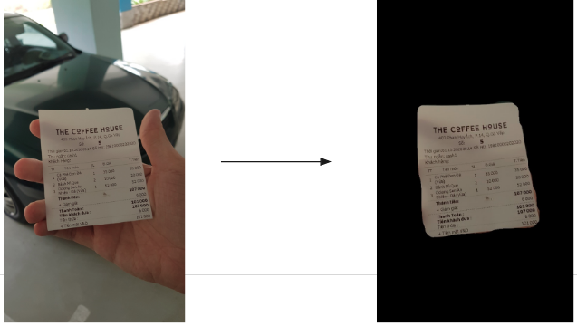
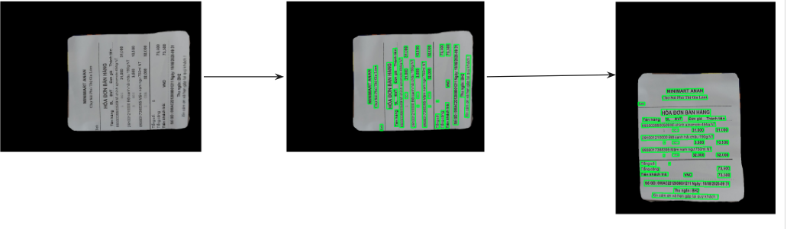
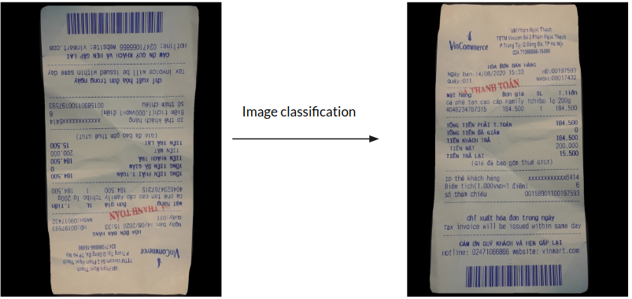
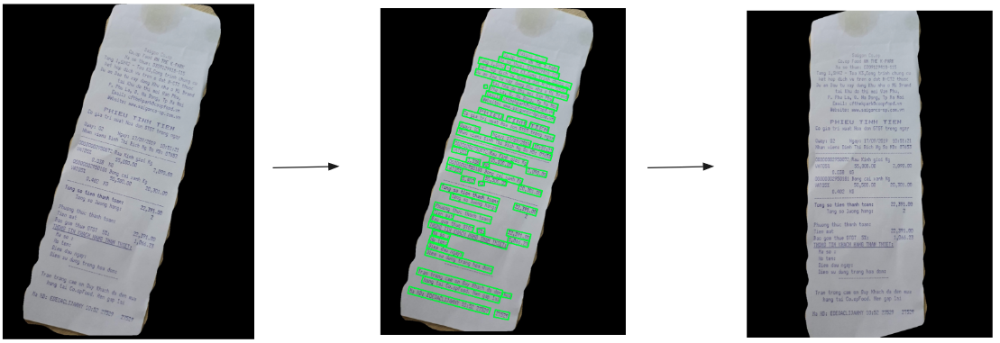
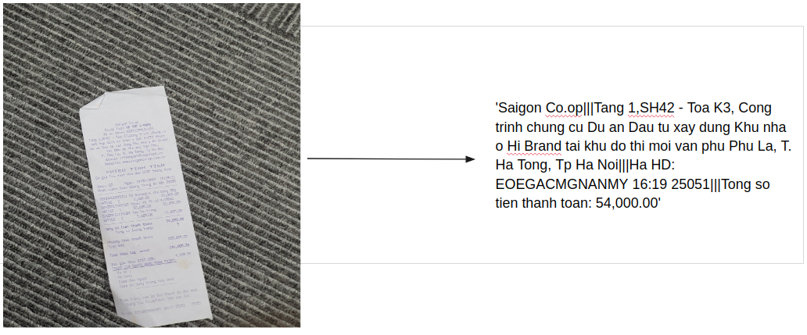

# mc-ocr
## Description
The Mobile capture receipts Optical Character Recognition (MC-OCR) challenge deliver two tasks: Receipt Image Quality Evaluation and OCR Recognition. In the first task,we  introduce a regression model to map various inputs such as the probability of the output OCR, cropped text  boxes, images to their label. In the second task, we propose a stacked multi-model as a solution to tackle this problem. The robust models are incorporated by image segmentation, image classification, text detection, text  recognition, and text classification. Follow this solution, we can get vital tackle  various noise receipt types such as horizontal, skew, and blur receipt.
## Getting Started
### Dependency
Firstly, you need to install libaries follow this code :
```
pip install -r requirements.txt
```
Then :
```
python -m pip install 'git+https://github.com/facebookresearch/detectron2.git'
```
### Run evaluate with pre-trained model
1. Download pretrained model from [here](https://drive.google.com/drive/folders/1W-O3hPQc4szNezeZQnowNrn46tcgLwz8?usp=sharing)
2. Add pretrained file to folder `weights/`
3. Run test.py
```
python3 test.py ----folder_test [path to folder test]

```
## Results
### Segmentation

### Rotate image

### Classification

### Align image

### Final our result



